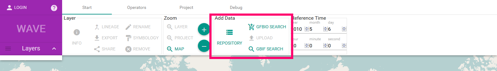
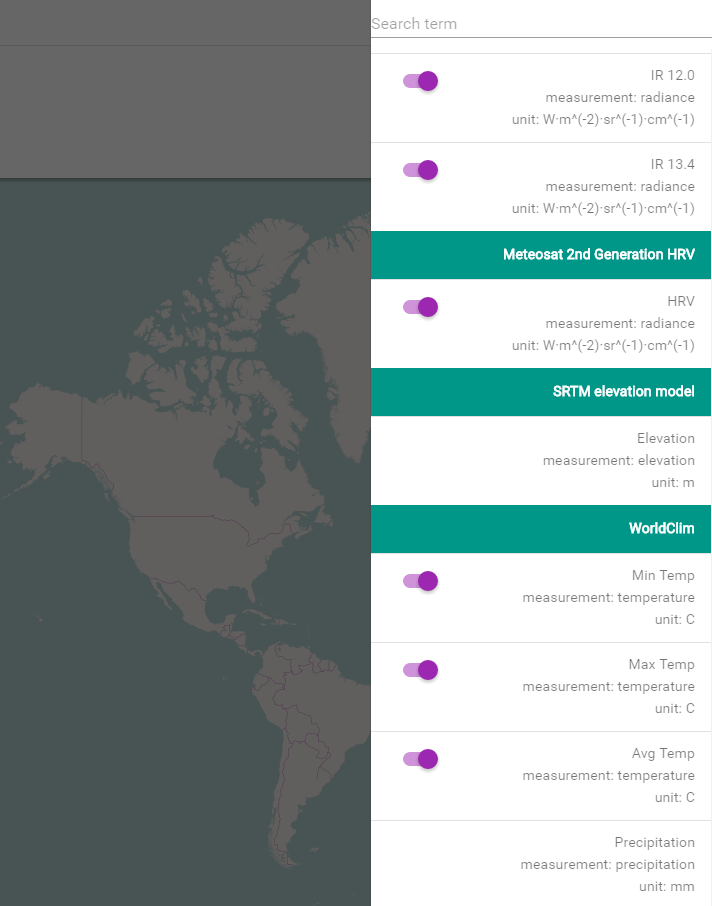

# WAVE Manual

## Overview
New users start with a new (empty) project.

The UI is build around the _central map_ component, where spatio-temporal data is displayed. The _top_ component is the ribbon-like header It provides access to data, operators and other features grouped by functionality. The layer list on the left side overlays the map and contains all visible data layers (with legends). Layer specific information is provided by the _bottom_ component which currently features a data table and citations.

---
__The 'Start'-ribbon__ contains the most frequently used operations:
* Layer specific functionality
* Zoom functionality for the map
* Data access
* Time selection / modification

---
__The 'Operators'-ribbon__ provides access to operators which allow to process data/layers. Operators are grouped by domain e.g. 'Vector' or 'Raster'.

---
__The 'Project'-ribbon__ provides access to project storage and Settings. A _project_ represents a working environment, consisting of all layers and plots.
* The storage group allows to load (and save) projects. _All projects are auto saved._
* The project configuration and the global lineage graph are available from the project group.

---

## Adding data / layers
Data / layers are added using one of the options provided by the _Add Data_ section of the _Start_-ribbon.

* The __Repository__ provides access to environmental data (raster). This includes the _SRTM_ elevation data and the _worldclim_ dataset.
* The __Upload__ functionality will allow users to add their own _private_ data to the VAT System.
* The __GFBio search__ will provide access to (the results / baskets of) the GFBio search.

### The (environmental data) Repository
Combining occurrences or other vector data with large environmental (raster) datasets is one of the features of the VAT System. The _repository_ contains all environmental datasets available on the VAT instance.

Each dataset can contain multiple channels (e.g. _WorldClim_). Selecting a channel will add it to the map. Some layers have a toggle button to switch between units (e.g. _Meteosat 2nd Generation_). Such layers are available as the raw / original values and a more user friendly representation as actual physical value.

The search field at the top allows search for a dataset or a channel.
