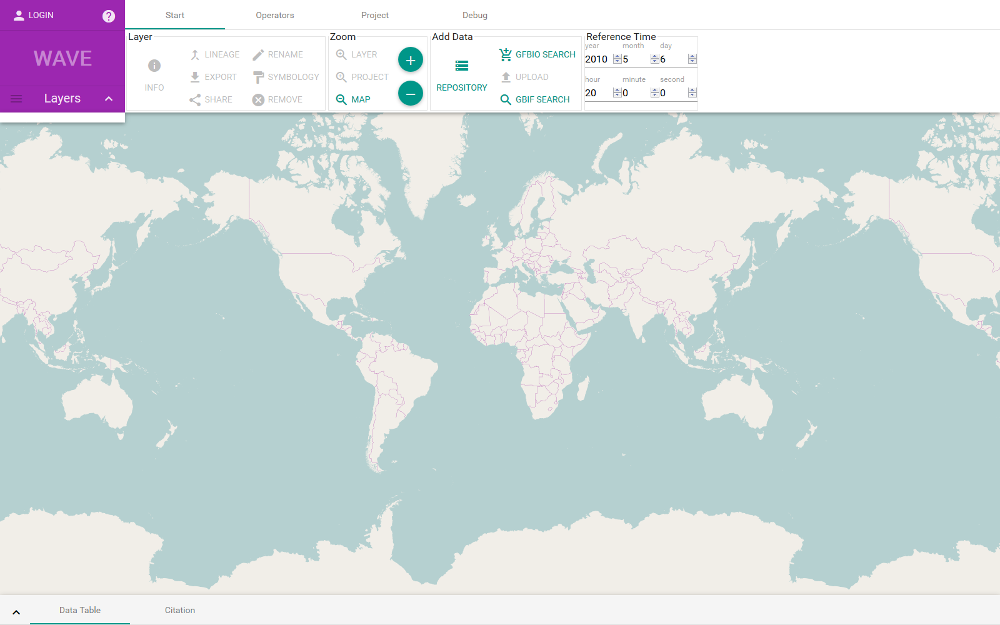
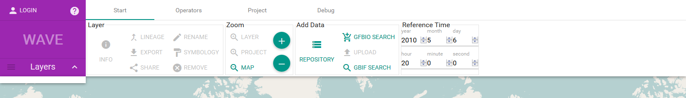
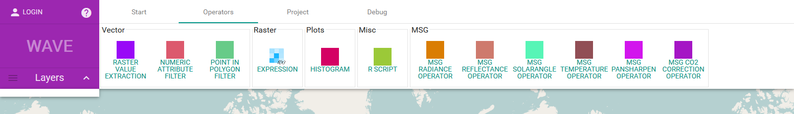
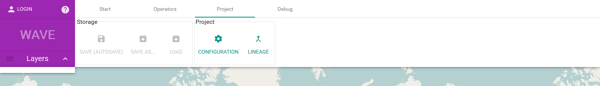

# WAVE Manual

## Overview
New users start with a new (empty) project.

The UI is build around the _central map_ component, where spatio-temporal data is displayed. The _top_ component is the ribbon-like header It provides access to data, operators and other features grouped by functionality. The layer list on the left side overlays the map and contains all visible data layers (with legends). Layer specific information is provided by the _bottom_ component which currently features a data table and citations.

---
__The 'Start'-ribbon__ contains the most frequently used operations:
* Layer specific functionality
* Zoom functionality for the map
* Data access
* Time selection / modification

---
__The 'Operators'-ribbon__ provides access to operators which allow to process data/layers. Operators are grouped by domain e.g. 'Vector' or 'Raster'.

---
__The 'Project'-ribbon__ provides access to project storage and Settings. A _project_ represents a working environment, consisting of all layers and plots.
* The storage group allows to load (and save) projects. _All projects are auto saved._
* The project configuration and the global lineage graph are available from the project group.

---
